<div align="center">

# TCP/IP Illustrated in 3D

[](https://maycon-bertolzodotcom.github.io/tcpip-illustrated-3d/)
[](#-scenes)
[](https://threejs.org)
[](#)

Interactive 3D visualizations of networking protocols from Stevens' *TCP/IP Illustrated*.
Each scene is a standalone HTML file — open directly in any browser, no server needed.

</div>

---

## Splat Scenes (3DGS Point Cloud)

Procedural point clouds generated via `splat_factory.py` — drag to orbit, scroll to zoom.

<table>
<tr>
<td align="center" width="33%">
<a href="scenes/splat-handshake/index.html">
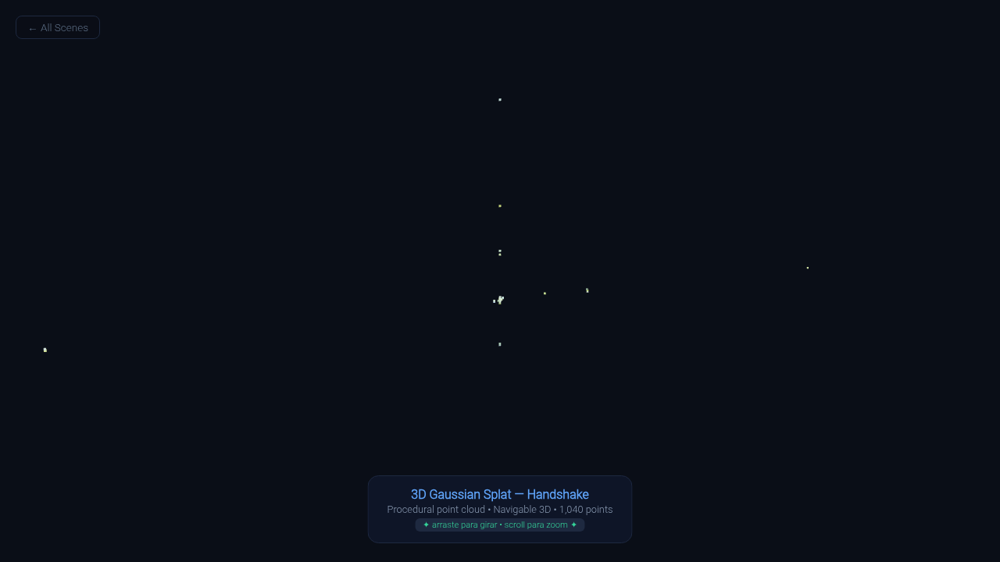
</a>
<br /><b>01</b> — Three-Way Handshake point cloud
<br /><sub>1,040 pts • <code>3DGS</code></sub>
</td>
<td align="center" width="33%">
<a href="scenes/splat-topology/index.html">
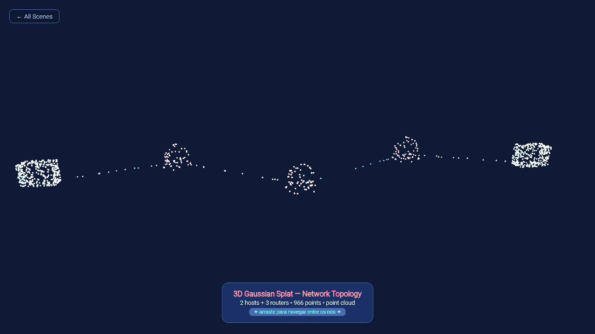
</a>
<br /><b>02</b> — 2 hosts + 3 routers network topology
<br /><sub>966 pts • <code>3DGS</code></sub>
</td>
<td align="center" width="33%">
<a href="scenes/splat-dns/index.html">
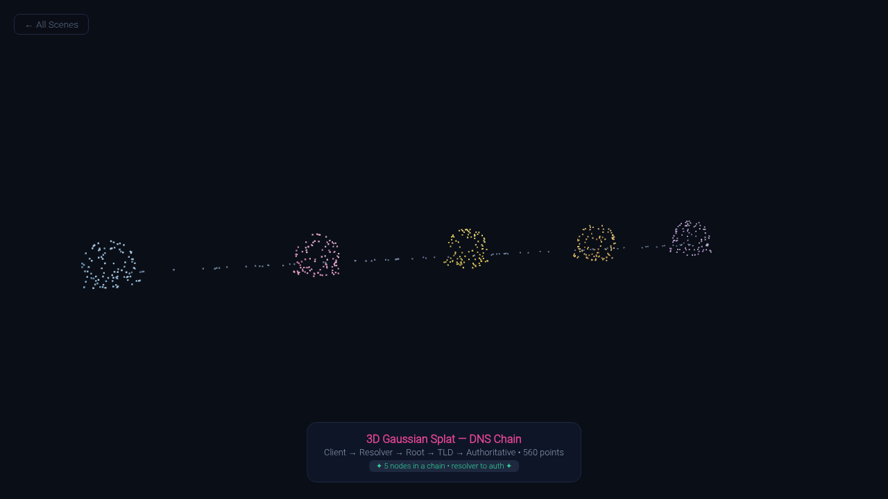
</a>
<br /><b>03</b> — 5-node DNS resolution chain
<br /><sub>560 pts • <code>3DGS</code></sub>
</td>
</tr>
</table>

<table>
<tr>
<td align="center" width="33%">
<a href="scenes/splat-tcp-state/index.html">
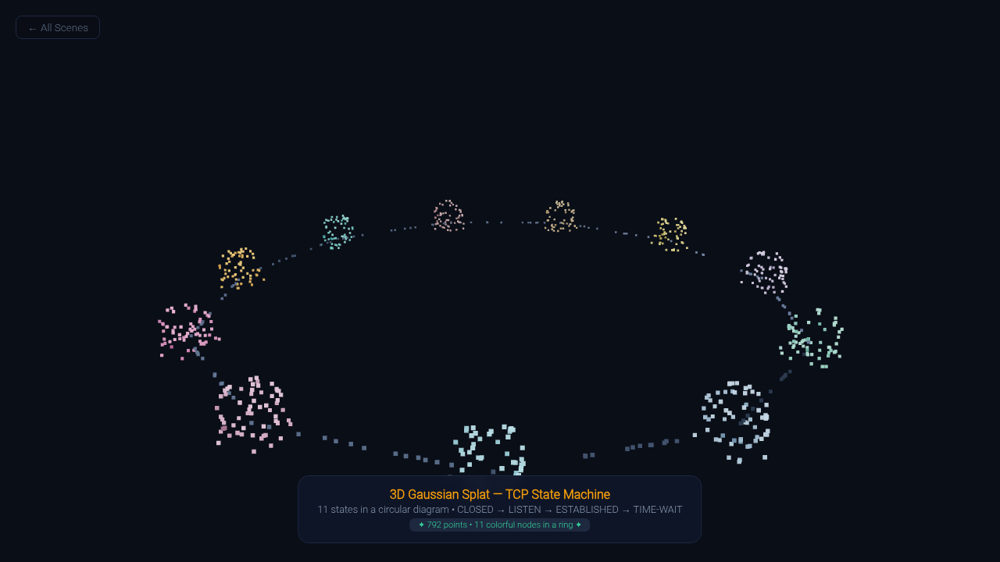
</a>
<br /><b>04</b> — 11-state circular diagram
<br /><sub>792 pts • <code>3DGS</code></sub>
</td>
<td align="center" width="33%">
<a href="scenes/splat-dhcp/index.html">
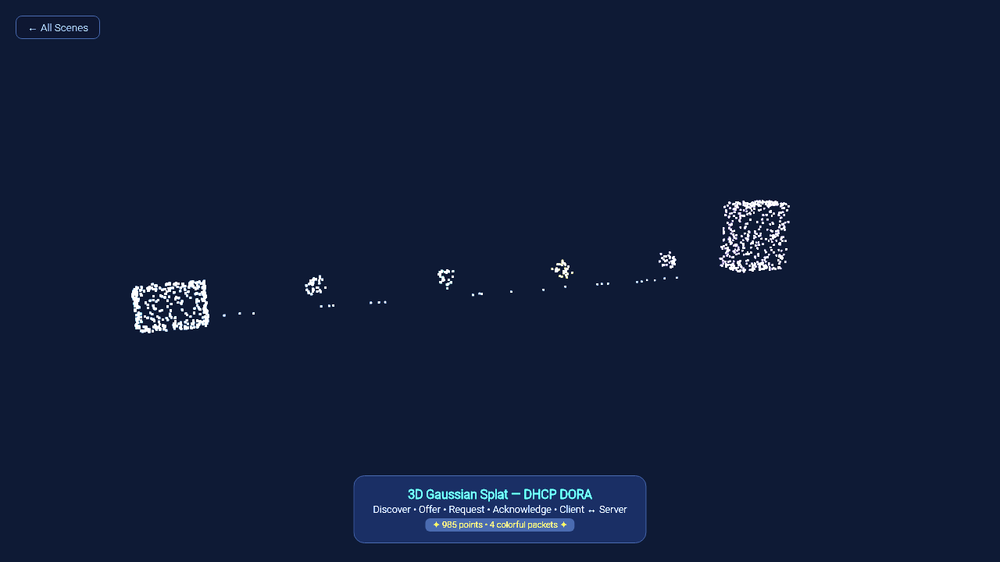
</a>
<br /><b>05</b> — DHCP DORA sequence
<br /><sub>985 pts • <code>3DGS</code></sub>
</td>
<td align="center" width="33%">
<a href="scenes/splat-ping/index.html">
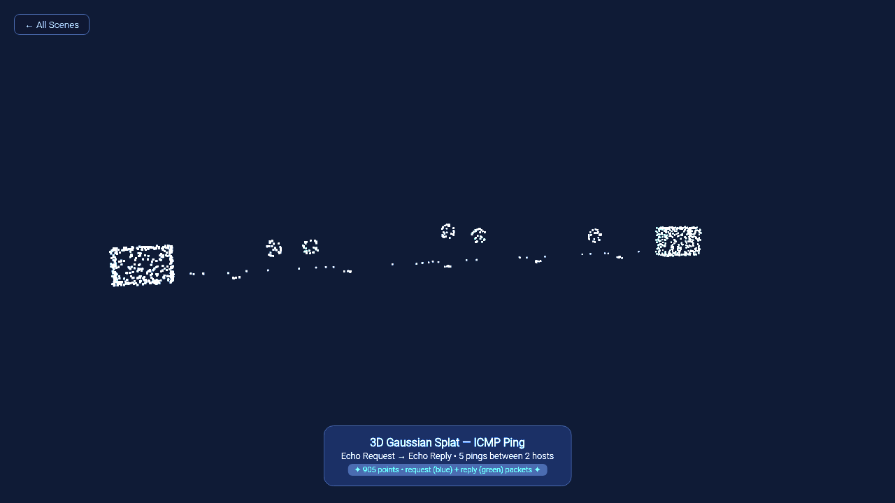
</a>
<br /><b>06</b> — ICMP Echo between two hosts
<br /><sub>905 pts • <code>3DGS</code></sub>
</td>
</tr>
</table>

<table>
<tr>
<td align="center" width="33%">
<a href="scenes/hybrid-handshake/index.html">
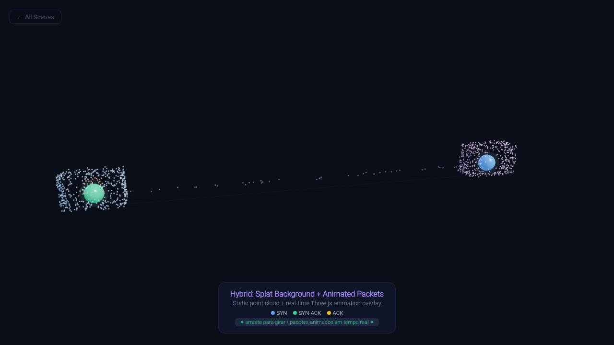
</a>
<br /><b>07</b> — Point cloud + animated SYN/SYN-ACK/ACK
<br /><sub>1,040 pts • <code>Hybrid</code></sub>
</td>
</tr>
</table>

---

## Animated Scenes (Three.js)

Each scene has real-time protocol animation — drag to orbit, watch packets flow.

<table>
<tr>
<td align="center" width="33%">
<a href="scenes/01-three-way-handshake/index.html">
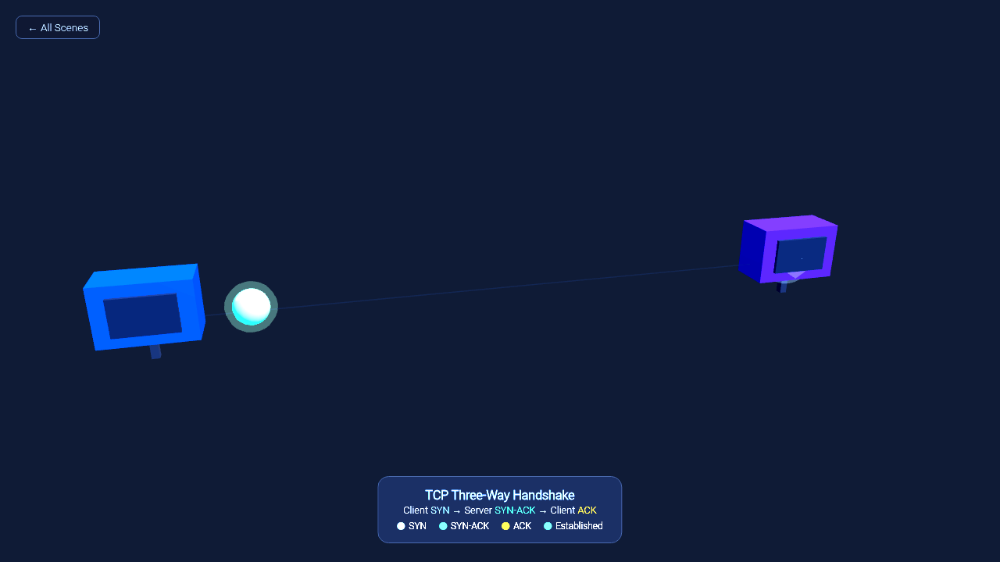
</a>
<br /><b>08</b> — SYN → SYN-ACK → ACK
<br /><sub><code>TCP</code></sub>
</td>
<td align="center" width="33%">
<a href="scenes/02-ip-fragmentation/index.html">
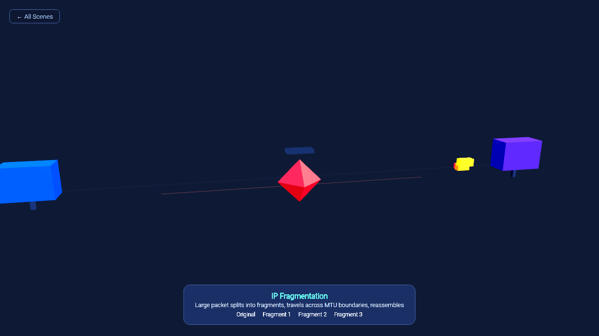
</a>
<br /><b>09</b> — Packet → 3 fragments → reassembly
<br /><sub><code>IP</code></sub>
</td>
<td align="center" width="33%">
<a href="scenes/03-tcp-window/index.html">
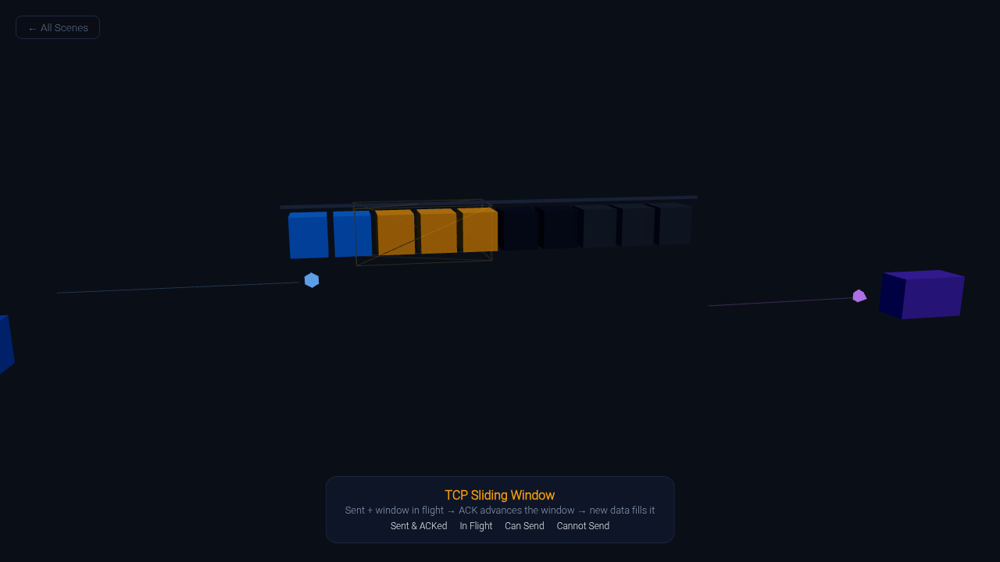
</a>
<br /><b>10</b> — 10-segment sliding window
<br /><sub><code>TCP</code></sub>
</td>
</tr>
</table>

<table>
<tr>
<td align="center" width="33%">
<a href="scenes/04-congestion-control/index.html">
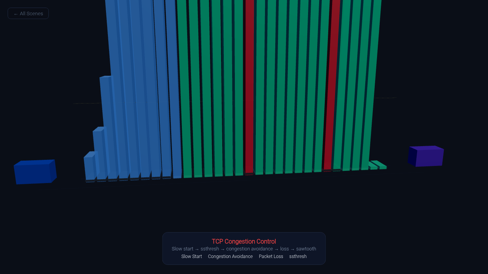
</a>
<br /><b>11</b> — 30-bar sawtooth diagram
<br /><sub><code>TCP</code></sub>
</td>
<td align="center" width="33%">
<a href="scenes/05-dns-resolution/index.html">
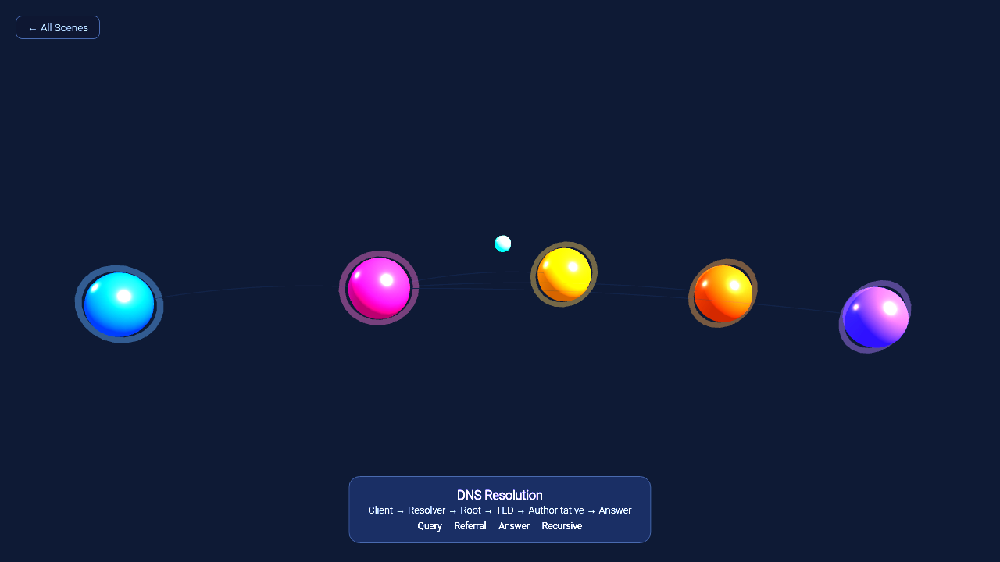
</a>
<br /><b>12</b> — Resolver → Root → TLD → Auth
<br /><sub><code>DNS</code></sub>
</td>
<td align="center" width="33%">
<a href="scenes/06-http-over-tcp/index.html">
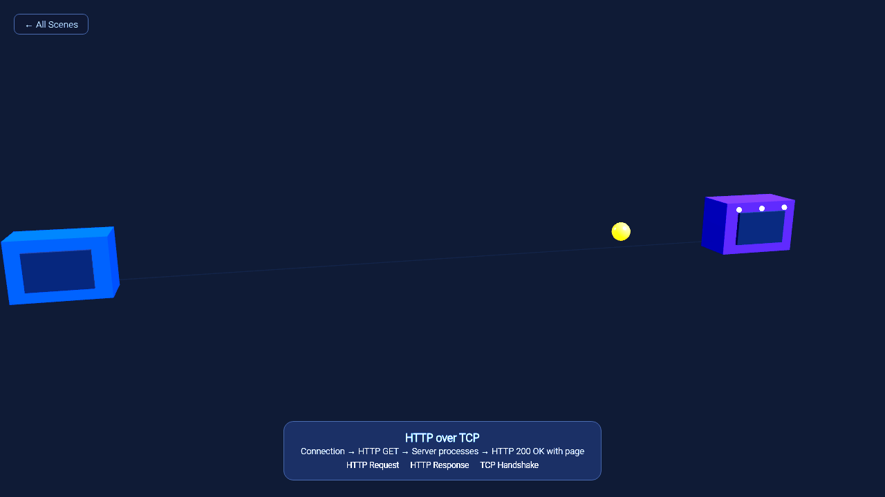
</a>
<br /><b>13</b> — Handshake → GET → 200 OK
<br /><sub><code>HTTP</code></sub>
</td>
</tr>
</table>

<table>
<tr>
<td align="center" width="33%">
<a href="scenes/07-arp/index.html">
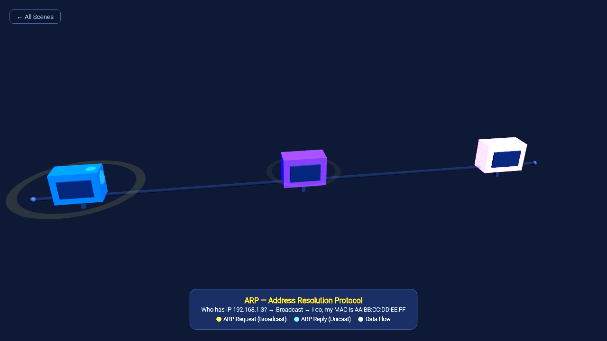
</a>
<br /><b>14</b> — Broadcast → Reply → MAC
<br /><sub><code>ARP</code></sub>
</td>
<td align="center" width="33%">
<a href="scenes/08-tcp-state-machine/index.html">
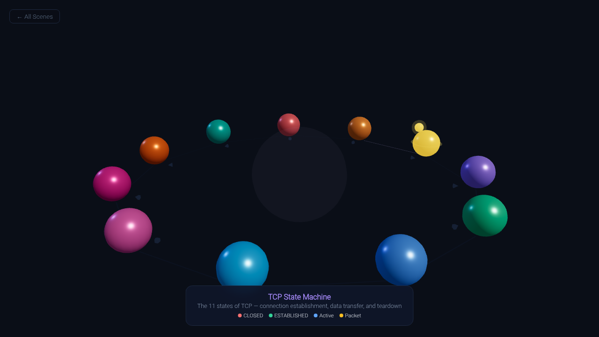
</a>
<br /><b>15</b> — 11-state circular diagram
<br /><sub><code>TCP</code></sub>
</td>
<td align="center" width="33%">
<a href="scenes/09-icmp-traceroute/index.html">
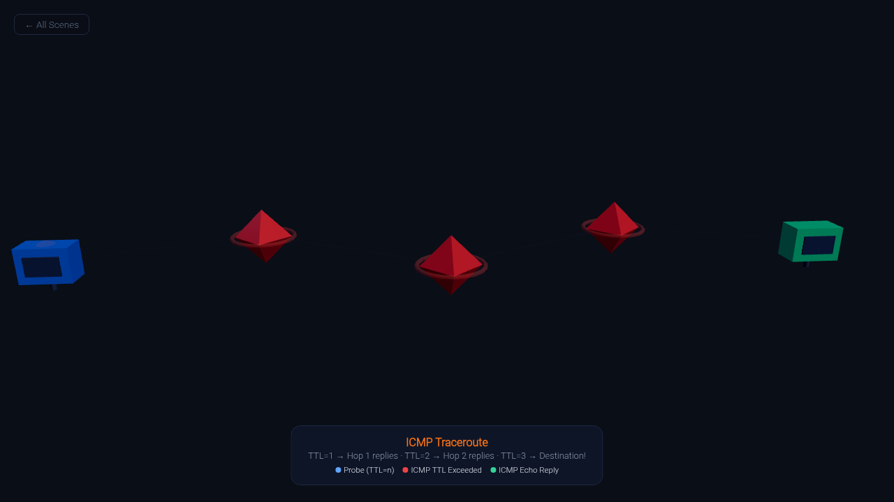
</a>
<br /><b>16</b> — TTL probes across 3 hops
<br /><sub><code>ICMP</code></sub>
</td>
</tr>
</table>

<table>
<tr>
<td align="center" width="33%">
<a href="scenes/10-udp-datagram/index.html">
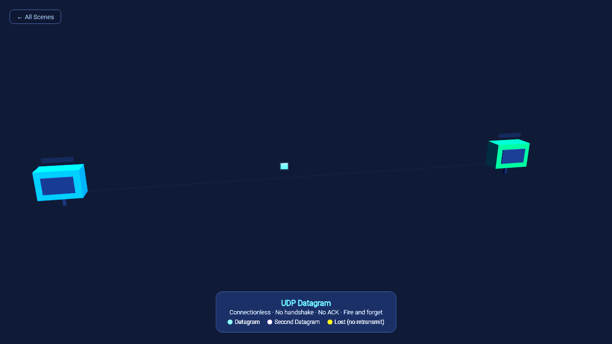
</a>
<br /><b>17</b> — Connectionless fire-and-forget
<br /><sub><code>UDP</code></sub>
</td>
<td align="center" width="33%">
<a href="scenes/11-routing-ttl/index.html">
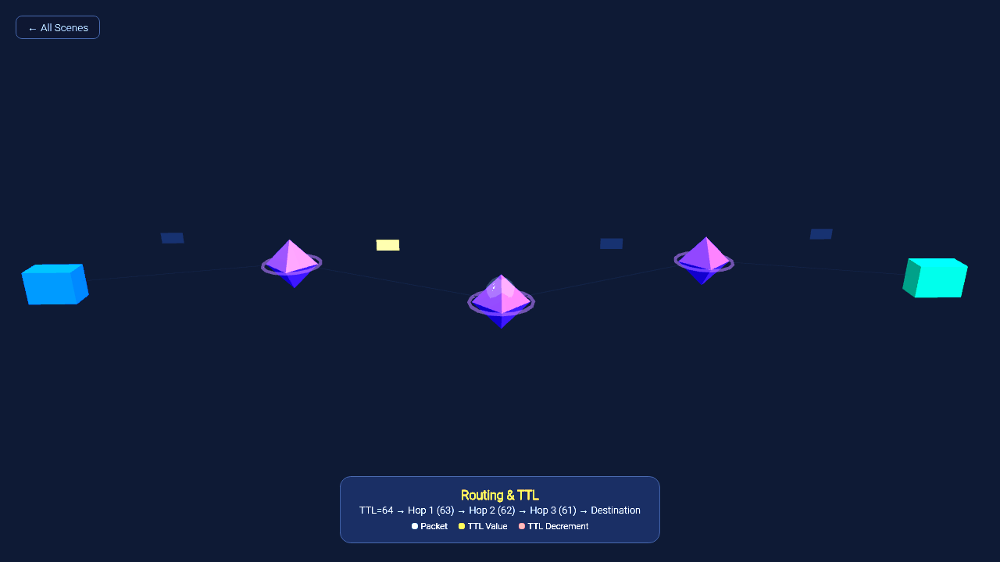
</a>
<br /><b>18</b> — TTL 64 → 61 across 3 hops
<br /><sub><code>IP</code></sub>
</td>
<td align="center" width="33%">
<a href="scenes/12-icmp-ping/index.html">
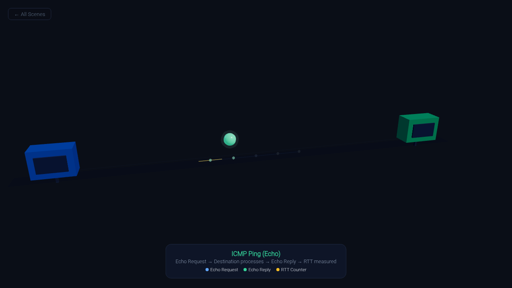
</a>
<br /><b>19</b> — 5 pings with RTT meter
<br /><sub><code>ICMP</code></sub>
</td>
</tr>
</table>

<table>
<tr>
<td align="center" width="33%">
<a href="scenes/13-dhcp-dora/index.html">
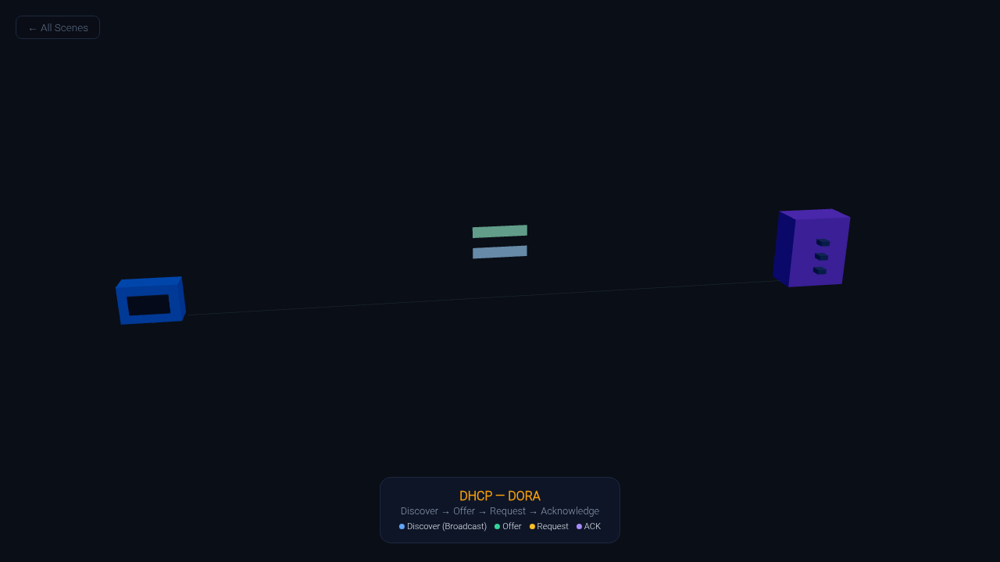
</a>
<br /><b>20</b> — Discover → Offer → Request → ACK
<br /><sub><code>DHCP</code></sub>
</td>
</tr>
</table>

---

## GLB Models (Procedural 3D)

Mesh-based GLB files generated with [`glb_factory.py`](scripts/glb_factory.py) — viewable in any GLTF viewer.

| Chapter | File | Verts | Description |
|---------|------|-------|-------------|
| 04 | [`arp_resolution.glb`](chapters/04-arp/scenes/arp_resolution.glb) | 1,022 | ARP broadcast + unicast reply |
| 06 | [`dhcp_dora.glb`](chapters/06-dhcp-dora/scenes/dhcp_dora.glb) | 1,162 | DHCP Discover→Offer→Request→ACK |
| 08 | [`handshake.glb`](chapters/08-tcp-connection/scenes/handshake.glb) | 1,434 | TCP Three-Way Handshake |
| 12 | [`dns_resolution.glb`](chapters/12-dns-resolution/scenes/dns_resolution.glb) | 2,279 | DNS Recursive Resolution |

Every `.glb` has a `_blinded.glb` variant with Sigil forensic protection (FAT32 + Ed25519, +32KB overhead).

### View GLB files

1. **Browser**: Drag into [gltf-viewer.donmccurdy.com](https://gltf-viewer.donmccurdy.com/)
2. **Three.js Editor**: https://threejs.org/editor/
3. **Blender**: File → Import → glTF 2.0

### Generate new scenes

```bash
python3 scripts/scenes/tcp_handshake.py     # → chapters/08-.../handshake.glb
bash scripts/blind_scene.sh --all            # blind all .glb files
```

### Forensic Protection (Sigil)

Every GLB can be signed with [Sigil](https://github.com/Maycon-BertolzoDOTCOM/Sigil) — a FAT32 partition is appended with an Ed25519-signed manifest. The file remains fully functional in any viewer.

```bash
# Blind a single file
PIXELGUARD_API_KEY=<key> bash scripts/blind_scene.sh input.glb

# Blind all GLB files
bash scripts/blind_scene.sh --all

# Verify a blinded file
pixelguardctl verify --image handshake_blinded.glb
```

---

## Quick Start

```bash
git clone https://github.com/Maycon-BertolzoDOTCOM/tcpip-illustrated-3d.git
cd tcpip-illustrated-3d
open scenes/01-three-way-handshake/index.html
```

> **No server. No dependencies.** Three.js vendored (1.4 MB). Open via `file://`.

---

<div align="center">

| Stat | Value |
|------|-------|
| Scenes | 20 (6 splat + 1 hybrid + 13 animated) |
| GLB Models | 4 (+ 4 blinded) |
| Point Cloud Vertices | 5,248 |
| GLB Vertices | 5,897 |
| Lines of Code | 6,300+ |
| Runtime Size | 1.4 MB (vendored Three.js) |
| Dependencies | 0 |

</div>

---

## Reference

- Stevens, W. Richard. *TCP/IP Illustrated, Volume 1: The Protocols*. Addison-Wesley, 1994.
- RFC 793, 791, 1034/1035, 5681

## License

MIT © Maycon Bertolzo